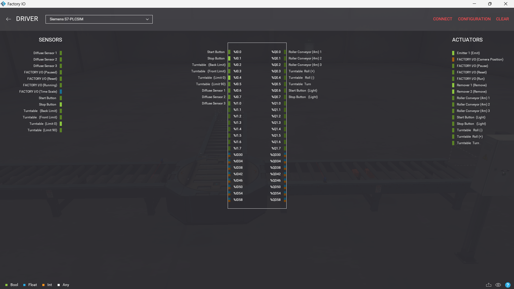
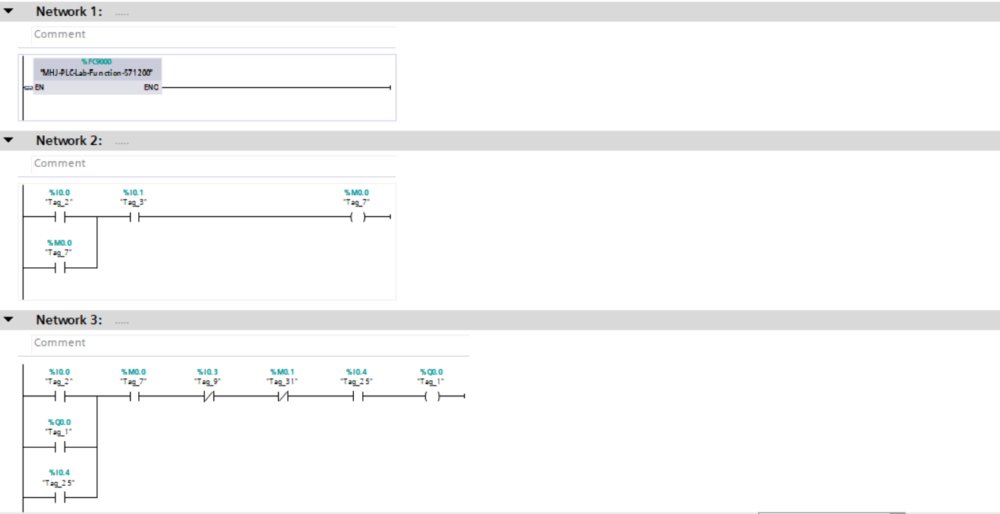
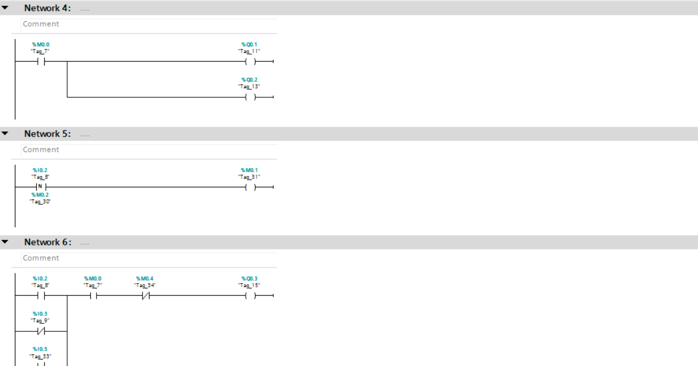
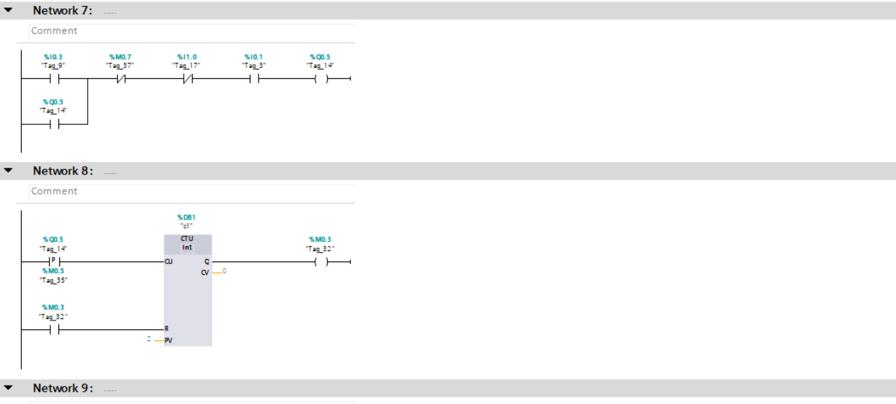
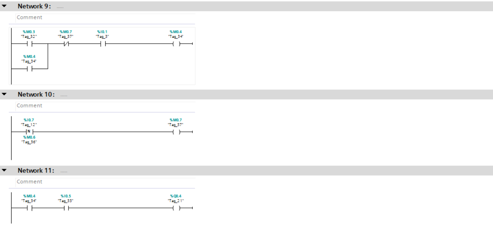
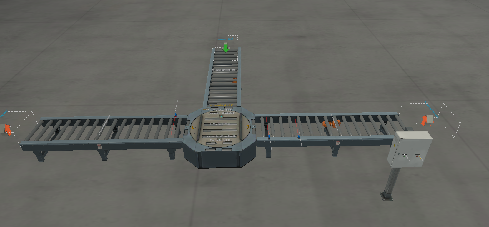

# PLC-TurnTable-Sorting-System

##  Project Overview
This project demonstrates an industrial sorting system based on a **Turn Table diverter mechanism**.

The system controls the direction of moving boxes on a conveyor line by dynamically switching the Turn Table position to route items either to the **left or right lanes**.

The entire process is controlled using **Siemens PLC** and simulated in **Factory I/O**.

---

##  Technologies Used
- **PLC Programming:** Siemens TIA Portal (S7-1200)  
- **Simulation:** Factory I/O  
- **PLC Simulation:** Siemens S7-PLCSIM  
- **Programming Language:** Ladder Diagram (LAD)  

---

##  Control Strategy (Turn Table Logic)

The system performs sorting based on directional control:

1. **Item Detection**
   - Sensors detect the presence of a box on the main conveyor  

2. **Decision Logic**
   - Control logic determines whether the box should go **Left or Right**  

3. **Turn Table Positioning**
   - Turn Table rotates to the required direction:
     - **Left Position**
     - **Right Position**

4. **Transfer Operation**
   - Internal belt of the Turn Table moves the box to the selected lane  

5. **Reset Position**
   - Turn Table returns to its default position after each operation  

---

##  Control Logic Highlights

- **Directional Sorting Logic**
  - Alternates or selects routing between left and right lanes  

- **Dual-Action Turn Table**
  - Rotation (Positioning) + Belt حركة (Transfer)  

- **Timer-Based Synchronization**
  - TON timers ensure accurate positioning before transfer  

- **Continuous Flow Handling**
  - Designed to handle multiple boxes without collision  

---

##  Project Preview

###  Driver Configuration

###  Ladder Logic Implementation
  
  
  

###  Factory I/O Scene

---

##  Demo Video
 [Watch the system in action](video.mp4)

---

##  Project Files Included
- TIA Portal Project File  
- Factory I/O Scene File  
- PLC Logic Screenshots  
- Full Simulation Video  

---

##  How to Run the Project
1. Open the project in **TIA Portal**  
2. Start **S7-PLCSIM** and download the program  
3. Open the scene in **Factory I/O**  
4. Connect using `S7-PLCSIM Driver`  
5. Press **Start** to begin operation  
